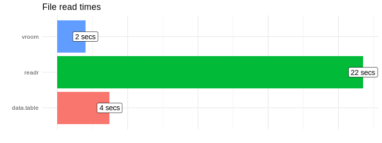
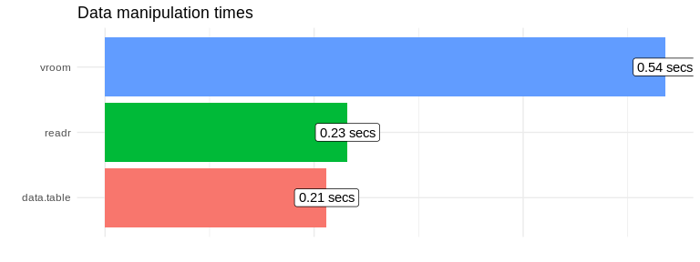

<!-- README.md is generated from README.Rmd. Please edit that file -->

# Data ingestion and manipulation

## Download and unpack data

``` r
if(!file.exists("flights.csv")) {
  download.file(
    "http://stat-computing.org/dataexpo/2009/2008.csv.bz2", 
    "flights.csv.bz2")
  R.utils::bunzip2(
    "flights.csv.bz2", 
    "flights.csv")
  unlink("flights.csv.bz2", force = TRUE)
  }
```

## Read data

### readr

``` r
library(readr)

tr <- system.time(
  flights_readr <- read_csv("flights.csv")  
)
#> Parsed with column specification:
#> cols(
#>   .default = col_double(),
#>   UniqueCarrier = col_character(),
#>   TailNum = col_character(),
#>   Origin = col_character(),
#>   Dest = col_character(),
#>   CancellationCode = col_character()
#> )
#> See spec(...) for full column specifications.

tr[[3]]
#> [1] 26.233
```

### data.table

``` r
library(data.table)

tdt <- system.time(
  flights_dt <- fread("flights.csv")  
)

tdt[[3]]
#> [1] 4.393
```

### vroom

``` r
tva <- system.time(
  flights_vroom_altrep <- vroom("flights.csv", altrep_opts = TRUE)
)
#> Observations: 7,009,728
#> Variables: 29
#> chr [ 5]: UniqueCarrier, TailNum, Origin, Dest, CancellationCode
#> dbl [24]: Year, Month, DayofMonth, DayOfWeek, DepTime, CRSDepTime, ArrTime, CRSArrTim...
#> 
#> Call `spec()` for a copy-pastable column specification
#> Specify the column types with `col_types` to quiet this message

tva[[3]]
#> [1] 2.264
```

### Results

``` r
library(tidyverse)

comparison <- tibble(
  readr = tr[[3]],
  `data.table` = tdt[[3]],
  vroom_altrep = tva[[3]]
)

comparison 
#> # A tibble: 1 x 3
#>   readr data.table vroom_altrep
#>   <dbl>      <dbl>        <dbl>
#> 1  26.2       4.39         2.26
```

``` r
comparison %>%
  gather() %>%
  ggplot() +
  geom_col(aes(fct_reorder(key, value), value, fill = key)) +
  coord_flip() +
  labs(x = "", y = "") +
  theme_bw() +
  theme(legend.position = "none")
```

<!-- -->

## Data manipulation

``` r
flights_readr %>% 
    group_by(Month) %>% 
    summarise(avg_delay = mean(ArrDelay, na.rm = TRUE))
#> # A tibble: 12 x 2
#>    Month avg_delay
#>    <dbl>     <dbl>
#>  1     1    10.2  
#>  2     2    13.1  
#>  3     3    11.2  
#>  4     4     6.81 
#>  5     5     5.98 
#>  6     6    13.3  
#>  7     7     9.98 
#>  8     8     6.91 
#>  9     9     0.698
#> 10    10     0.415
#> 11    11     2.02 
#> 12    12    16.7
```

### Transformations

``` r
mr <- system.time(
  flights_readr %>% 
    group_by(Month) %>% 
    summarise(avg_delay = mean(ArrDelay, na.rm = TRUE))
)
mva <- system.time(
  flights_vroom_altrep %>% 
    group_by(Month) %>% 
    summarise(avg_delay = mean(ArrDelay, na.rm = TRUE))
)
mdt <- system.time(
  flights_dt[!is.na(ArrDelay), .(avg_delay = mean(ArrDelay)), Month]
)
```

### Results

``` r
comp <- tibble(
  readr = mr[[3]],
  `data.table` = mdt[[3]],
  vroom_altrep = mva[[3]]
)

comp
#> # A tibble: 1 x 3
#>   readr data.table vroom_altrep
#>   <dbl>      <dbl>        <dbl>
#> 1 0.226      0.311         1.33
```

``` r
comp %>%
  gather() %>%
  ggplot() +
  geom_col(aes(fct_reorder(key, value), value, fill = key)) +
  coord_flip() +
  labs(x = "", y = "") +
  theme_bw() +
  theme(legend.position = "none")
```

<!-- -->
